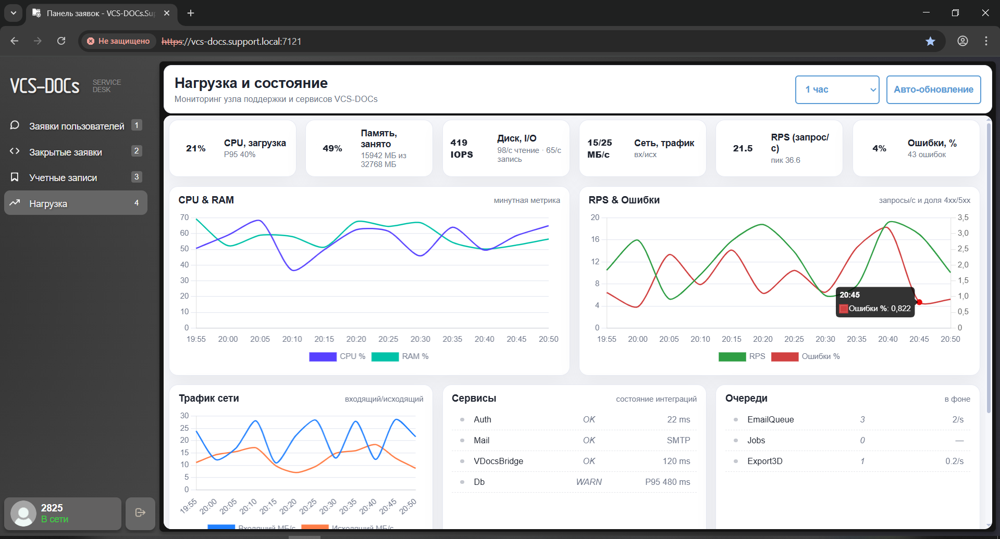
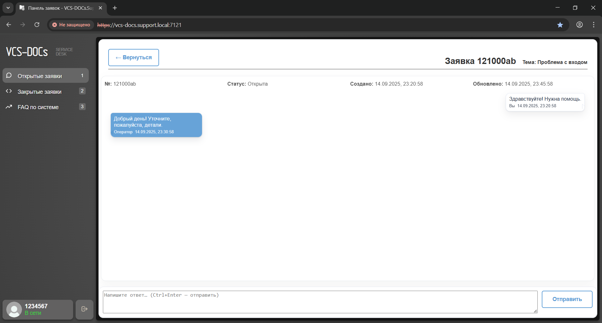

# VCS-DOCs

Веб-платформа для хранения, контроля версий и отслеживания изменений в конструкторской документации (чертежи, 3D-модели, сканы, текстовые файлы) с поддержкой **AR/VR**, **PLM-модуля** и **таск-менеджера**. Подходит как для частных лиц, так и для компаний (организации, сотрудники, роли). Платформу можно развернуть **во внутренней сети** компании; лицензирование — через центральный сервер. Конструкторам и технологам не нужно ставить тяжёлое ПО: достаточно мощного сервера и браузера.

  
  &nbsp;&nbsp;
  

---

## 📌 Возможности

- 📁 **Хранилище КД**: хранение версий файлов в ЛК (реализовано). В планах: история изменений, сравнение  
- 🧩 **PLM / задачи**: В планах: постановка, маршруты, статусы  
- 🥽 **AR/VR-просмотр** В планах: 3D-моделей в браузере  
- 👥 **Организации и роли**: админы, операторы, пользователи  (реализовано)
- 🛡️ **Единая сессия (single-login)** и принудительное отключение активных вкладок (SignalR) (реализовано)
- 🔔 **E-mail уведомления**, фильтры и поиск по заявкам  (реализовано в саппорт проекте)
- 🧱 Развёртывание on-prem (внутренняя сеть), конфиг через файлы  (в планах)

---

## 🖼️ Скриншоты

  
  &nbsp;&nbsp;
  

  

  

  

---

## Целевая аудитория

- Инженеры промышленных предприятий
- Отделы технической документации  
- Производственные и R&D-компании  

---

## 🧰 Технологический стек

- **.NET 9 / ASP.NET Core** (Razor Pages)  
- **SignalR** — онлайн-статусы и принудительное завершение сессий  
- **EF Core + SQLite** — хранение данных  
- **ASP.NET Identity** — пользователи/роли  
- **BCrypt.Net** — верификация паролей  
- **CSS** + JS

---

## 📄 Лицензия

Этот репозиторий распространяется на условиях **проприетарной лицензии**.
Любое использование кода (в т.ч. компиляция, модификация, распространение, хостинг как сервис)
без **письменного коммерческого договора** с правообладателем запрещено. 

Для коммерческих лицензий и партнёрств: warmenzim@mail.ru.  
Полный текст — см. [LICENSE.txt](./LICENSE.txt).

